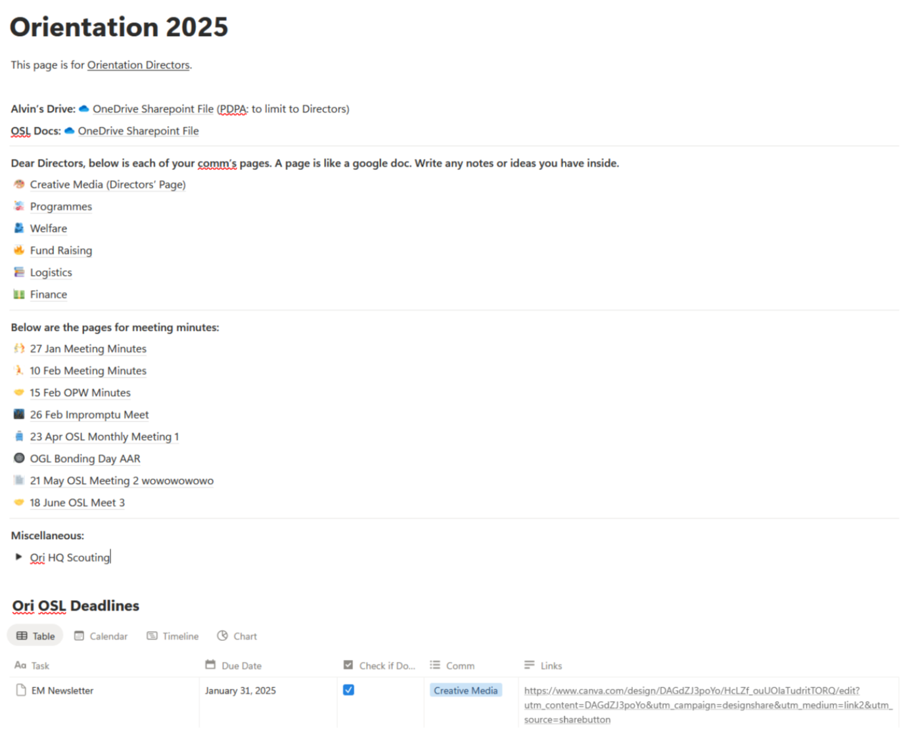

## Admin things
- Not sure who’s helping you; our year had a lot of changes (2 OSL staff leaving in succession 🫠) but more people came in and divided up the work between them
- Usually the deadlines OSL sets for you have buffer built in — you **can** ask for extension, right when you get it or later on, but keep in mind that might make things harder/more rushed in terms of getting approval and everything else that comes after
- When it comes to giving deadlines/extensions to your comm, you can give an earlier deadline than whenever OSL said you need to do it, this way you can give extensions to your comm without needing to ask OSL/push other things back too much
- **NOTION:** vincent (CM) set up a notion so we could take meeting minutes and keep track of everyone’s deadlines easily. Honestly a lot of potential just didn’t use it as much as I should have,,,
- **ONEDRIVE/GDRIVE:** alvin (PD) set up a onedrive for us so the entirety of Ori could have all our info in the same place and each subcomm would just only have access to their folder but the directors could see everything. Which was a good idea but I forgot why we did that and went and created a google drive for my comm bc i liked the ui better…… which just ended up making everything messy. If ocomm decides on one platform to use, USE IT PLS.

Vincent’s notion:

## Key deadlines (for 2025)

Deliverable(s) | Date | Note
:-|:-|:-
Confirm dry run date | Mar 24 | 
Dry Run Proposal | Apr 6 Mon | Dry Run Venue and Logistics Booking Form - Logs
OGL Bonding Day | 5 May | Not free: chen chen
Finale Proposal, Draft invitation to GOH | Jun 1, Mon
Dry Run invoices and claims | Jun 25, Wed | Finance
Dry Run | Jun 28-30, Sat-Mon | Logs and venue booking form - Logs
Final Proposal | Jun 29, Sun | 
All other Purchase Award Forms (≥$1000) from programmes or logistics (if applicable) | July 20, Sun | Finance
COMPASS Application | Aug 11, Mon
All student claims and invoices | Aug 31, Sun | Finance
ORI | 11-13 Sep, Thurs-Sat | All hands on deck
Submit remaining invoices and claims (if any) for Actual Orientation Days | 15 Sep, Mon | Finance

## Writing a Proposal
- Be as specific as possible  
  - How are the points scored? E.g. 5 red balls = 1 point
  - What are the rules? What are people allowed/not allowed to do (for safety reasons and so the game runs smoothly)
  - What logs are required? DO NOT list e.g. “some balls” you are making Logs’ and your own lives harder when you need to actually acquire the things you need to play the games DO: “30 red and 15 green balls”, list everything you need including stopwatches, demarcation tape etc. think through EVERYTHING you need to set up and play a game. Your comm should help you do this. Attempting to do it all yourself is how you lose your sanity.
  - Layouts, manpower allocations etc. don’t need to be in the first draft but they should be made well in advance of when you need them and ocomm at least should know about your plans
- OSL will probably ask you to make changes in suggesting mode. This is stupid and messy especially when multiple people are editing. I did not fight them on this, please feel free to (pick your battles wisely), but I can understand why it makes it easier for them to see when changes have been made. (the final doc with game rules, safety hazards and layouts was about 90 pages.)